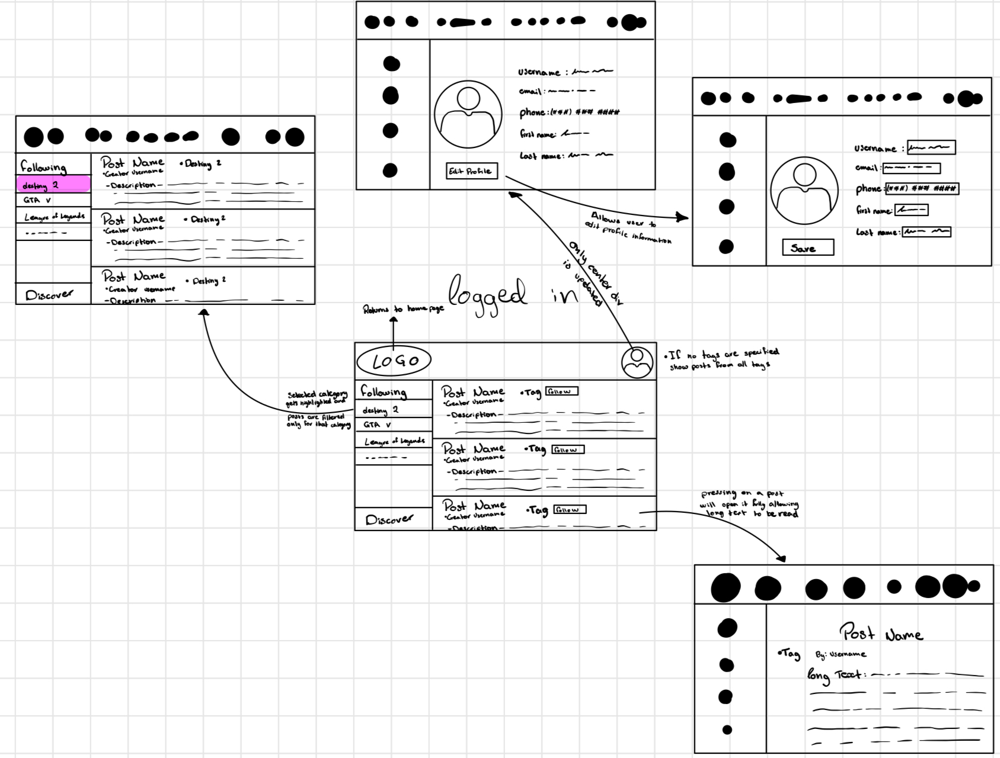
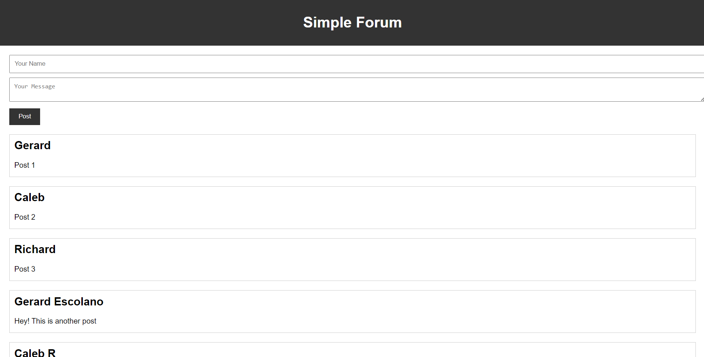

# Gaming Enthusiasts Hub 🎮

A full-featured discussion forum platform for gamers to connect, share experiences, and stay updated on the latest in gaming. Built as a university group project.

[](https://php.net)
[](https://mysql.com)
[](https://getbootstrap.com)
[](LICENSE)
[](SECURITY.md)

---

## ✨ Features

- **User authentication** — Register, log in, log out with secure bcrypt password hashing
- **Community forums** — Create and join topic-based gaming forums
- **Posts & comments** — Full CRUD for posts and threaded comments
- **Like system** — Like posts with real-time feedback
- **Admin roles** — Two-tier: site-wide admins and per-forum moderators
- **Profile management** — Update account details and upload profile images
- **Search** — Find forums by name
- **Responsive design** — Dark-themed UI built with Bootstrap 5

---

## 📸 Screenshots

| Home Page | Forum View |
|---|---|
|  |  |

---

## 🛠 Tech Stack

| Layer | Technology |
|---|---|
| **Frontend** | HTML5, CSS3, JavaScript (ES6), Bootstrap 5.3, jQuery |
| **Backend** | PHP 8.x (no framework), PDO |
| **Database** | MySQL 8.x |
| **Icons** | Font Awesome 4.7 |
| **Auth** | Session-based + bcrypt |

---

## 🏗 Architecture

```
DiscussionForum/
├── css/              # Stylesheets
├── docs/             # Design docs & screenshots
├── drawable/         # Images, icons, logos
├── php/              # Backend logic (API + controllers)
├── scripts/          # Client-side JavaScript
├── sql/              # Database schema
├── views/            # HTML templates
├── .env.example      # Environment config template
├── .gitignore
├── index.html        # Redirect to views/Home.html
└── README.md
```

### Database Schema (6 tables)

```
users ──< posts          (one user → many posts)
users ──< postmessages   (one user → many comments)
users ──< inforum        (M:N users ↔ forums)
users ──< hasliked       (M:N users ↔ posts)
forums ──< posts         (one forum → many posts)
posts ──< postmessages   (one post → many comments)
```

---

## 🚀 Getting Started

### Prerequisites

- PHP 8.0+ with `pdo_mysql` extension
- MySQL 8.0+
- Apache / Nginx (or `php -S` built-in server)

### Quick Start

```bash
# 1. Clone the repo
git clone https://github.com/RikepilB/DiscussionForum.git
cd DiscussionForum

# 2. Configure environment
cp .env.example .env
# Edit .env with your database credentials

# 3. Import the database schema
mysql -u your_user -p < sql/MySQL_db_37431970.sql

# 4. Start the PHP dev server
php -S localhost:8000

# 5. Open http://localhost:8000 in your browser
```

### Docker (alternative)

```bash
docker-compose up -d
# Open http://localhost:8000
```

---

## ☁️ Deployment

### Vercel (frontend static hosting)

This project can be deployed on Vercel for the static frontend assets:

[](https://vercel.com/new/clone?repository-url=https%3A%2F%2Fgithub.com%2FRikepilB%2FDiscussionForum)

> **Note:** PHP backend requires a separate PHP-compatible host or serverless runtime.

### Traditional PHP Host

1. Upload all files to your web root
2. Set up a MySQL database and import `sql/MySQL_db_37431970.sql`
3. Configure `.env` with your database credentials
4. Ensure `pdo_mysql` PHP extension is enabled

### Recommended Platforms

| Platform | PHP Support | MySQL |
|---|---|---|
| [Railway](https://railway.app) | ✅ | ✅ |
| [Heroku](https://heroku.com) | ✅ | ✅ (via ClearDB) |
| [DigitalOcean App Platform](https://digitalocean.com) | ✅ | ✅ |
| Shared hosting (cPanel) | ✅ | ✅ |

---

## 🔒 Security

This project has been audited and all identified vulnerabilities have been fixed:

- ✅ **bcrypt password hashing** (replaced MD5)
- ✅ **CSRF protection** on all mutation endpoints
- ✅ **XSS prevention** (safe DOM APIs + `htmlspecialchars`)
- ✅ **SQL injection prevention** (PDO prepared statements)
- ✅ **Secure file upload** (MIME + extension validation)
- ✅ **No hardcoded credentials** (environment variables)
- ✅ **Safe redirects** (no open redirects)

---

## 👥 Team

| Member | Role |
|---|---|
| Caleb Reurink | Developer |
| Richard Pillaca | Developer |
| Gerard Escolano | Developer |

---

## 📄 License

Distributed under the MIT License. See `LICENSE` for more information.
